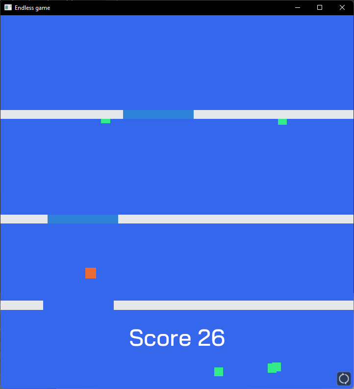

## Description
This is a small endless game written in Rust with the bevy game engine 0.5.

- Click, drag and release to push the player into a direction
- Collect green food to increase the score
- Collecting one food will spawn two more
- Passing gates will increase the score
- The game will speed up with an increasing score
- You lose if you crash into a wall or reach the bottom of the screen
- After losing the deathscreen is displayed. Press respawn to respawn
- The game will be paused if the window loses focus or after pressing __ESC__
- Continue by clicking anywhere

## How to run
### During development
```shell
cargo run
```
### Building
```shell
cargo build --release
```
Then copy the binary into the root folder (above **assets**).

## Bevy features used
- 2D Camera, UI Camera
- Translate, Rotate
- Assets: Font, Sounds
- UI: Text, Buttons
- Keyboard & mouse input with a drag gesture
- Sprites, ColorMaterials
- Game states
- Time delta
- Spawning & despawning entities

## What could be improved
- [ ] Divide the code into plugins / modules so the project is not one file with 1000 lines of code
- [ ] Load ColorMaterials once at startup. Currently they are reloaded with every respawn
- [ ] When the game is paused, the timer isn't stopped. So after continueing, two walls may be together very closely
